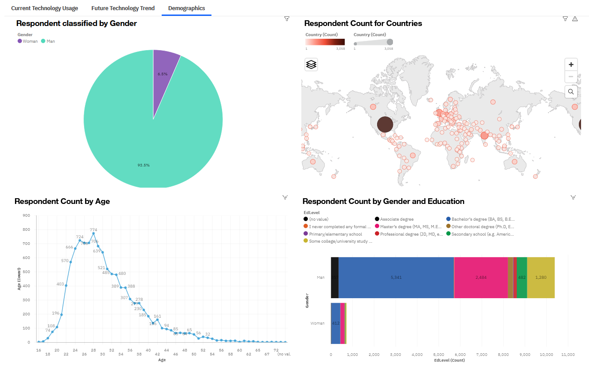

# IBM Data Analyst Capstone Project
## Course 9 from 9 of IBM Data Analyst Professional Certificate

The jupyter notebook files - modified and running from my Anaconda environment, because I prefer working in my laptop (not depends on the internet connectivity). Unfortunately, I can't upload the csv and sqlite file because it's too large for the github free account. Certain lines of code maybe add/modified from the original, to adapt some near deprecated function or to make properly running using Anaconda.

Spend a lot of time to make my IBM Cognos Embedded Dashboard to be fully running, because I have accident unintentionally delete the object storage. I spend hours to connect my IBM Cloud Object Storage to IBM Watson Cloud Data Pak which connect to IBM Cognos Embedded dashboard. After everything running, I also spend hours to make my IBM Cognos Dashboard peer-graded assignment on weeks 5 to be more beautiful and stunning. I also upload the <a href="ibm data analyst c9w5.json">JSON</a> file for the Cognos dashboard deployment. My final dashboard is <a href="https://eu-gb.dataplatform.cloud.ibm.com/dashboards/9af46cf1-0425-42e6-8cb5-abcad107a1d7/view/5128e138318c1fcd55b2d4e4079e2a017b352d58e0bbd603d5d47b4909357997f33a47c5c8794b0fdb160d35faee115a9c">here</a>

 
 
 
